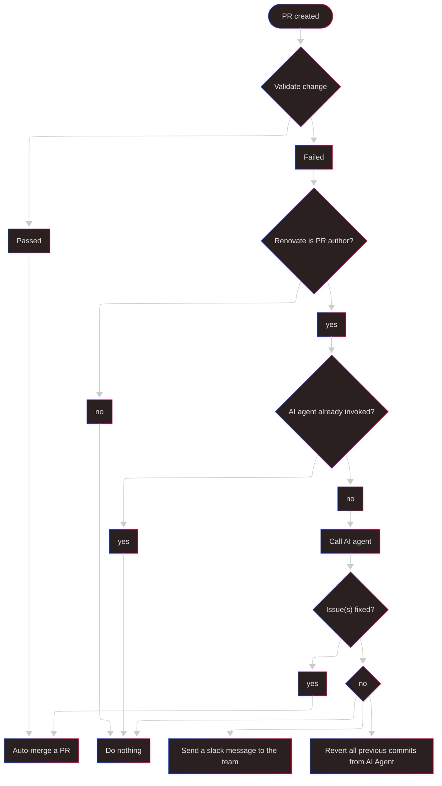

## Legacy projects

You know how software engineers always want to work on greenfield projects and complain about legacy projects? But who are the people creating those legacy projects? 
Yes, it's the software engineers. We're the ones creating the mess we're complaining about. It's not the PM/PO, not the CTO/CEO/COO, not the auditors... it's us!

Yet, when the next interview comes around, most will complain to talent-aquisition person or later HR person how they don't want to work on legacy projects. This is just running away from your own responsibilities. You just don't have the strength to admit that you don't want to deal with the mess you created, and the easiest way is to "abandon ship" while complaining how things are slow, chaotic and unmaintained.

One very, very, very common problem is dependency management and dealing with obsolete libraries.

## Dependency management

I have never in my life met a software engineer who was happy/enthusiastic about dependency management. Have you ever hear any engineer say "I'm very exicted to spend a week migrating all dependencies to a newer version, just to do it again next week"? Safe to say, you didn't.

More often than not, upgrading dependencies doesn't bring any direct value to your project. We want to work on projects, delivering solutions to interesting and complex problems. We want to make some meaningful work and have an impact. Not go through changelogs of all libraries, upgrade libA from version `1.2.3` to `1.2.4` as it's not interesting, fun nor impactfull work.

So what if we can do a bit of magic to resolve MOST of these boring tasks in a good old fashion... by not doing them at all.

But hey, this means creating legacy, unmaintained projects, right? NO!
Just because we, software engineers won't do it, doesn't mean it won't get done.

## Setup phase 1 - unsupervised CI/CD

Here we will define some basic rules to ensure safe delivery to production, yet enabling us to have fully automated dependency upgrades. The concept of [unsupervised CI/CD](https://sasa-fajkovic.com/2025-02-16-unsupervised-cicd/) was described in [this blog post](https://sasa-fajkovic.com/2025-02-16-unsupervised-cicd/).

- Utilize tools for automatic dependency management like [Renovate](https://docs.renovatebot.com/) to have scheduled and frequent creation of pull requests to upgrade dependencies.

- Ensure your CI pipelines, and your tests are good enought that you trust them. Your CI must have one or more required checks to pass. *Example - tests must pass before you can merge a PR. If the tests fail, you must not be able to merge a PR.*

- Enable Renovate to auto-merge pull requests.

- Ensure a PR can be merged ONLY when it's branch is up to date with the base branch. *GitHub example: turn on `Require branches to be up to date before merging`*

## Setup phase 2 - CI pipeline

Your pipeline should have **at minimum** a job like `Validate change` which builds the project and runs the tests. The `Validate change` job must be green/sucessful ONLY if the build and test steps do not fail.

Then you add a second job called `Call AI agent` which depends on the `Validate change` job and is executed only if the author of the pull request is Renovate **AND** only if the `Validate change` job has failed.

**Pro tip:** Ensure to post a comment on a pull request, or at least add a label which will be your flag if an AI agent was already invoked for this pull request or not. If the AI agent was already invoked, do not invoke the AI agent again for this pull request.

That's it, you're ready to enjoy the magic.

## Visual representation

