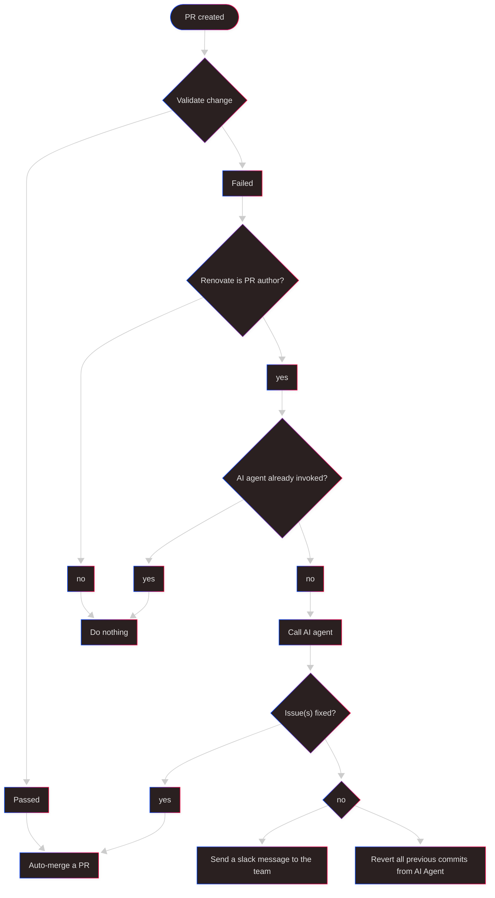

# Introduction: The Dependency Nightmare

> I have never in my life met a software engineer who was enthusiastic about dependency management. Have you ever heard any engineer say something like:
> "I am very excited to spend a week migrating all dependencies to a newer version, just to do it all over again next week"? Safe to say, you haven't.

Dependency management is the silent killer of developer productivity and the hidden creator of technical debt. But what if there was a way to make this pain disappear almost entirely?

# Legacy projects

You know how software engineers always want to work on greenfield projects and complain about legacy projects? But who are the people creating those legacy projects? 
It's those same software engineers. We (software engineers) are the ones creating the mess we're complaining about. It's not the PM/PO, not the CTO/CEO/COO, not the auditors... it's us!

Yet, when the next interview comes around, most will complain to talent-acquisition/recruiters how they don't want to work on legacy projects. 

This is just running away from your own responsibilities. You just don't have the strength to admit that you don't want to deal with the mess you created, and the easiest way is to "abandon ship" while complaining how things are slow, chaotic and unmaintained.

One of the most pervasive causes of legacy projects is poor dependency management and the accumulation of obsolete libraries. It's like technical debt on steroids, growing silently in the background until it's too late.

# Dependency Management: The Necessary Evil

More often than not, upgrading dependencies doesn't bring any direct business impact to your project. We want to work on projects, delivering solutions to interesting and complex problems. We want to make meaningful work and have a tangible impact.

We do not want to go through changelogs of all libraries, upgrade `libA` from version `1.2.3` to `1.2.4` and repeat this over and over again. This is not interesting, fun, nor impactful work. It's the software engineering equivalent of doing dishes – necessary but thoroughly uninspiring.

So what if I told you there's a way to resolve **MOST** of these boring tasks with a bit of modern magic? Not by ignoring them, but by automating them intelligently.

But wait, isn't automation of maintenance tasks just a pathway to creating more legacy, unmaintained projects? **Absolutely not!** 

Just because we, software engineers, won't manually do it, doesn't mean it won't get done. It just means we're smart enough to delegate this work to the perfect assistant: AI.

---

# The AI-Powered Solution: Practical Setup

Let's build a system that works while you sleep. Below, we'll define a set of practical rules to ensure safe delivery while enabling fully automated dependency upgrades. This builds on my concept of [unsupervised CI/CD](https://sasa-fajkovic.com/2025-02-16-unsupervised-cicd/) that I described in detail in [a previous blog post](https://sasa-fajkovic.com/2025-02-16-unsupervised-cicd/).

## Phase 1 - dependency management bot

- Utilize tools for automatic dependency management like [Renovate](https://docs.renovatebot.com/) to have scheduled and frequent creation of pull requests to upgrade dependencies.

- Enable Renovate to auto-merge pull requests.

## Phase 2 - repository setup

- Your repository must have one or more required checks to pass. *Example - tests must pass before you can merge a PR. If the tests fail, you must not be able to merge a PR.*

- Ensure a PR can be merged ONLY when the pr-branch is up to date with the base branch. *GitHub example: turn on `Require branches to be up to date before merging`*

## Phase 3 - CI pipeline

- Ensure your CI pipeline and your tests are good enough that you trust them completely. 

- Your pipeline should have **at minimum** a job like `Validate change` which builds the project and runs the tests. The `Validate change` job must be green/successful ONLY if the build and test steps do not fail.

- Add a second job called `Call AI agent` which depends on the `Validate change` job and is executed only when:
  - the author of the pull request is Renovate **AND** 
  - only if the `Validate change` job has failed.

**Pro tip:** Ensure to post a comment on a pull request, or at least add a label to a pull request. These will be used as flags if an AI agent was already invoked or not for this pull request. If the AI agent was already invoked, do not invoke the AI agent again for this pull request.

# The Magic Formula: Results You Can Expect

## Simplified Workflow Visualization

- PR Created -> Test pass -> auto merge ✅
- PR Created - Tests fail -> Call AI agent -> auto merge if fixed ✅
- PR Created - Tests fail -> Call AI agent -> revert changes if not fixed ❌

## Power User Pro-Tips: Taking It to the Next Level

- Revert AI agent changes - If an AI agent wasn't able to fix the PR, you should probably revert the changes to reduce noise. Simply revert all commits the AI agent made.

- Instruct your AI agent if possible to send a slack message when it failed to fix the PR so you can put more focus on it.

## Detailed visualisation

---

Here's the code for the mermaidchart in case you need it

